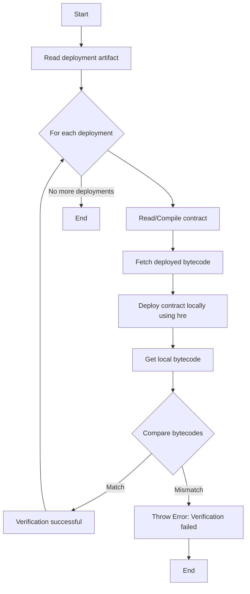

 
# Smartcontract Bytecode Verification

This repository demonstrates a workflow for verifying the bytecode in GitHub CI for locally deployed (upgradeable) smart contracts. 

> Avalanche testnet (Fuji) has been used in this repo for demonstration purposes.

## How to Use

1. Deploy contracts locally.
2. The deploy script should write a JSON array with the following structure (see next section).
3. Save the JSON file as `<NETWORK>-deployments.json` (e.g., `mainnet-deployments.json` for Ethereum).
4. All deployments should be made from the `main` branch.
5. Each deployment artifact should only contain info of contracts deployed at that moment.
6. The branch name should start with `deploy/*` and target the `main` branch.
7. Verification will start running in CI actions as soon as the PR is opened.
8. We can add a rule to block merging if CI fails.
9. Use the verification command: `npx hardhat verify-deployment --network <NETWORK>`

### Deployment artifact (JSON)

- `address`: The address of the deployed contract
- `name`: The name of the contract
- `timestamp`: Deployment timestamp
- `isProxy`: `true` if it's a new deployment (proxy + implementation)
- `isImplementation`: `true` for upgrades, only implementation contracts will be deployed
- `args`: Constructor arguments, if any

**Example**:
```json
[
  {
    "address": "0x1234",
    "name": "Box",
    "timestamp": 1724579038,
    "isProxy": true,
    "isImplementation": false,
    "args": []
  }
]
```

## How It Works

The `verify-deployment.js` Hardhat task verifies the deployment based on the following flow:



## Note

This is still a work in progress tool and is subject to change.